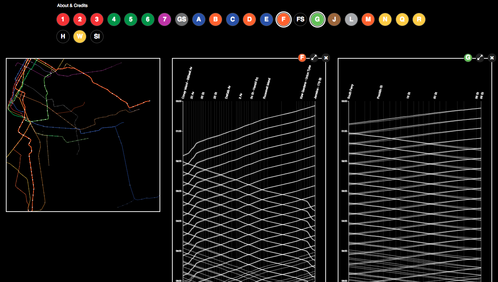

# Visually Exploring NYC Subway Journeys
CUSP Data Visualization Project (Group 7) [Demo](http://subways.pythonanywhere.com/)

**Authors**: Assel Dmitriyeva, Rachel Xin Rong Lim, Ben Steers

**Description**: Exploring NYC subway journeys across all lines in the city using MTA GTFS Data Feed from one day in November 2017. We present a visual analytics system for detection, inspection and comparison of spatio-temporal patterns across subways lines. Users can interact with subway map to better understand subway schedules and station information. 

